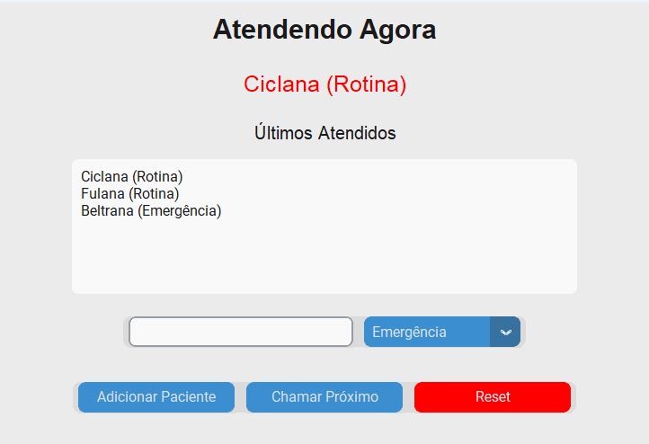

# Hospital Triage System
*(Based on the exercise [Sistema de Triagem de Hospital](https://neps.academy/br/course/fundamentos-das-estruturas-de-dados/lesson/sistema-de-triagem-de-hospital) from [Neps Academy](https://neps.academy))*
This project was developed based on the **Sistema de Triagem de Hospital** exercise from **Neps Academy**.  
It is a desktop application written in **Python** that simulates an emergency room triage system, focusing on the practical application of **priority queues** and **data structure concepts**, rather than real hospital systems.
The application ensures that patients are attended according to **urgency level**, not just arrival order, while maintaining a clean and intuitive graphical interface built with **CustomTkinter**.

---

## Features

- Add new patients with name and priority level;
- Three priority levels:
  - **Emergência** (highest priority)
  - **Urgente**
  - **Rotina** (lowest priority)
- Always call the next patient based on priority;
- Correctly handle ties using arrival order;
- Display the current patient being attended;
- Show a history of the last attended patients;
- Reset the system to start a new simulation;
- Real-time interface updates.

> **Note**  
> This application is a **simulation** and does **not represent a real hospital system**. The focus is on data structures and application logic.

---

## Data Structures Used
- **Priority Queue (`heapq`)**
    A priority queue is used to manage patient flow. Patients with higher urgency are always attended first. Each patient is stored as a tuple: `(priority_value, arrival_order, name, priority_label)`
- **Counter (Integer)**  
  Resolves ties when multiple patients have the same priority, ensuring FIFO behavior within the same priority level.
- **List (`list`)**  
  Stores and displays the history of recently attended patients.

---

## Interface

Below is a preview of the application's interface:



---

## How to Run
Follow the steps below to run the project locally.

```bash
git clone https://github.com/maaluuzete/hospital-triage-system.git
cd hospital-triage-system
python -m venv venv
pip install -r requirements.txt
python main.py
```
## Project Structure
```
sistema-triagem-hospitalar/
│── main.py
│── triage_system.py
│── requirements.txt
│── README.md
│── home.png
```
